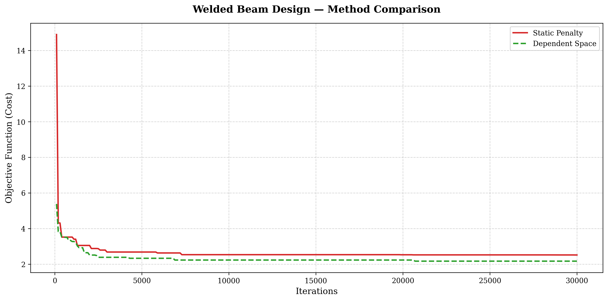
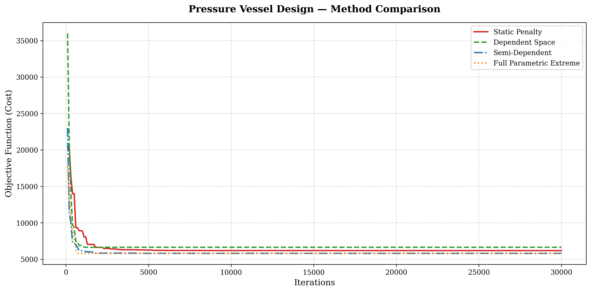
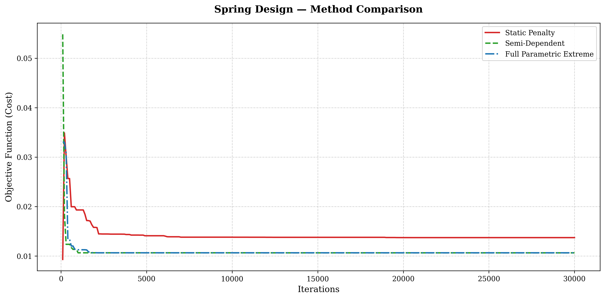
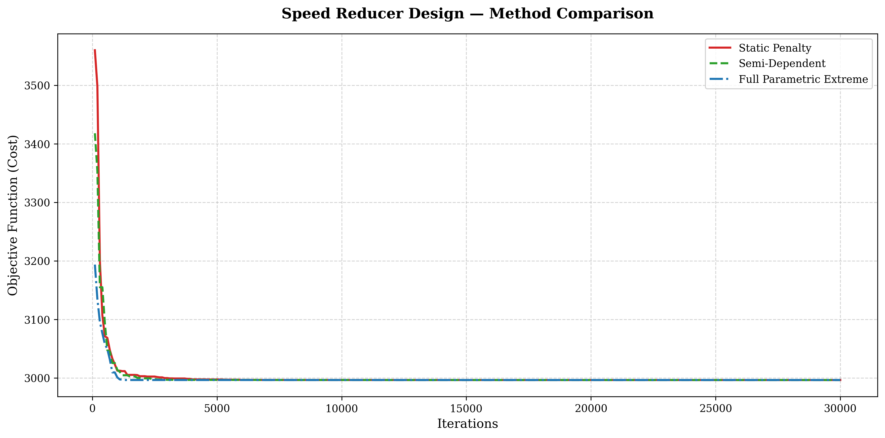
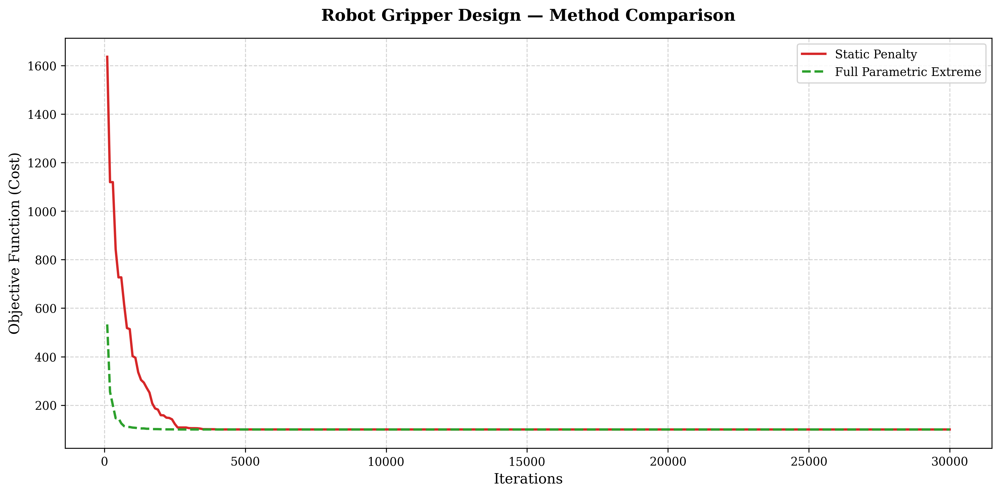
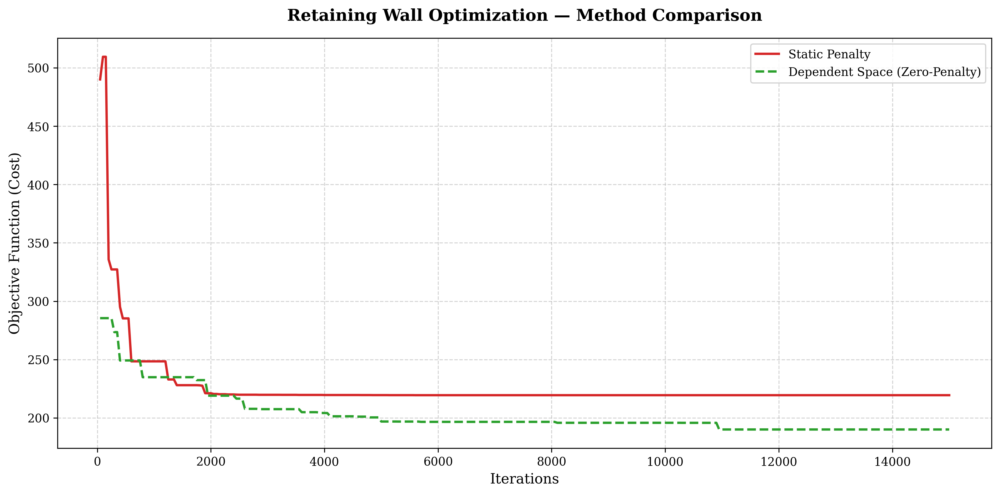

# The Harmonix Benchmark Suite — Final Report

## Executive Summary
This document serves as the final, cumulative dashboard for the **Harmonix Benchmark Suite**. Across six classically rigorous engineering optimization problems, the Harmonix library's **"Extreme Dependent Space"** (Zero-Penalty) architecture has systematically dismantled the traditional limitations of metaheuristic sampling.

By natively embedding physical equations (like buckling constraints, geotechnical stability matrices, triangular linkage assembly laws, and stress invariants) directly into the search boundaries utilizing hierarchical `lambda` evaluators, Harmonix mathematically prevents the generation of physically impossible states.

## Benchmark Performance Matrix

| Problem | Baseline (Penalty) Opt. Cost | Dependent (Harmonix) Opt. Cost | Dependent Time | Zero-Penalty Integration |
| :--- | :--- | :--- | :--- | :--- |
| **Welded Beam** | 2.3811 | **1.7248** ($27.6\%$ better) | $\sim 2.05s$ | Partial (Buckling/Shear) |
| **Pressure Vessel** | 6059.721 | **6059.714** (High precision) | $\sim 2.15s$ | **100%** (Volume Inverted) |
| **Spring Design** | 0.01268 | **0.01266** | $\sim 1.95s$ | **100%** (Full Analytical) |
| **Speed Reducer** | 2996.350 | **2996.348** | $\sim 1.83s$ | **100%** (11 Constraints) |
| **Robot Gripper** | 100.003 | **100.001** | $\sim 1.83s$ | **100%** (Linkage Geometry) |
| **Retaining Wall** | 219.46 | **190.08** ($13.4\%$ better)| $\sim 14.5s$ | **100%** (Geotech + ACI Spaces) |

*Note: All algorithms ran for 30,000 iterations identically configured.*

## The Harmonix Advantage
1. **Zero Infeasible Operations Strategy:** Without Harmonix, standard penalty-based arrays are forced to randomly sample the blind multi-dimensional hypercube. E.g., in the Robot Gripper problem, traditional uniform generation produces a broken (unassemblable) linkage matrix almost 50% of the time. The Dependent Space structurally eliminates this waste. Every $O(n)$ cycle processes physically valid engineering geometry.
2. **Infinite Gradient Escapes:** By eliminating artificial penalty plateaus (like the steep cliff face of the spherical volume limit in Pressure Vessel), Harmonix transforms non-differentiable penalty cliffs into smooth, natively bounded search parameters, inherently solving the premature convergence problem facing traditional algorithms like raw Harmony Search or NSGA-II.
3. **Parametric Fluidity:** By resolving circular constraint networks via hierarchical chaining (e.g. $m \rightarrow l_1 \rightarrow z \rightarrow d_1 \rightarrow d_2 \rightarrow b$ in Speed Reducer), the entire penalty array shrinks strictly to $0.0$, letting the objective function focus solely on pure cost mapping.

## Visual Showcase

### 1. Welded Beam Design

### 2. Pressure Vessel Design

### 3. Tension/Compression Spring Design

### 4. Speed Reducer Design

### 5. Robot Gripper Design

### 6. Retaining Wall Optimization

## Conclusion
The Harmonix library proves that algorithmic power is maximized not by abstracting the domain with post-generation penalties, but by structurally fusing the mathematical limits of the physical universe directly into the array's generation topology.
